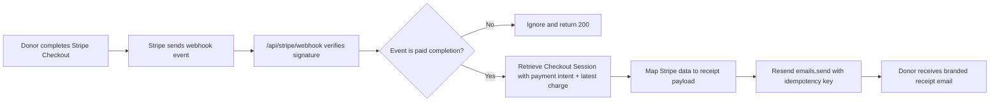

# Architecture Review

## Slice Boundary

Changes in scope:

- Stripe Checkout Session creation metadata for receipts
- Stripe webhook verification and event handling
- Resend client setup and donation receipt sender
- one branded email template
- README and task artifacts

Out of scope:

- donation page UI changes
- legacy Payment Intent fulfillment changes
- persistent receipt storage
- hosted template management in the Resend dashboard

## Architecture Summary

The site will keep Stripe Checkout as the payment surface, but move receipt sending to a server-side webhook when an explicit enable flag is on and the required env vars are present. Checkout Session creation will attach receipt metadata and only stop forcing Stripe-native email receipts when the custom receipt path is ready. A new webhook route will verify Stripe signatures, react only to paid completion events, retrieve expanded session/payment details, and send a branded React email through Resend with an idempotency key tied to the Stripe event.

## Data Flow

## State Transitions

- `checkout.session.completed` with `payment_status !== paid`: no receipt is sent
- `checkout.session.completed` with `payment_status === paid`: receipt is sent
- `checkout.session.async_payment_succeeded`: receipt is sent
- Stripe webhook retry for the same event: Resend idempotency key suppresses duplicate sends
- Custom receipt flag disabled or not ready: Checkout continues using Stripe receipt delivery and webhook ignores receipt sends
- Missing email or malformed webhook config: request is logged and acknowledged without crashing the route

## Trust Boundaries

- Client input: donor email and donation amount are validated before Checkout Session creation
- Stripe webhook: must be treated as untrusted until the signature is verified with `STRIPE_WEBHOOK_SECRET`
- Resend API: outbound side effect that can fail independently and should not be triggered for unpaid events
- Environment variables: required for Stripe webhook verification, sender configuration, and explicit custom-receipt rollout enablement

## Edge Cases And Failure Modes

- Stripe retries the same webhook event
- Checkout completes but payment is still processing
- Session has no usable donor email
- Resend API key or from-address env var is missing
- Local or preview environment lacks a stable site URL for email asset links
- Stripe dashboard customer receipts remain enabled and still send a second receipt outside this code path

## Test Matrix

- Happy path: paid Checkout Session webhook sends one branded receipt with correct amount and reference
- Async path: `checkout.session.async_payment_succeeded` sends the receipt
- Unpaid completion: webhook returns success without sending email
- Retry path: duplicate webhook event uses the same Resend idempotency key
- Config failures: missing `STRIPE_WEBHOOK_SECRET` or `RESEND_API_KEY` fail clearly in server logs
- Regression: existing donate page and return page still lint and type-check without flow changes

## Rollout, Rollback, And Observability

- Rollout: deploy the webhook route, add env vars, and register the Stripe webhook endpoint
- Rollback: remove the webhook endpoint or unset the Resend env vars; Checkout itself remains unchanged
- Observability: log unsupported webhook events, missing donor email, and Resend send failures with Stripe event/session IDs for debugging
