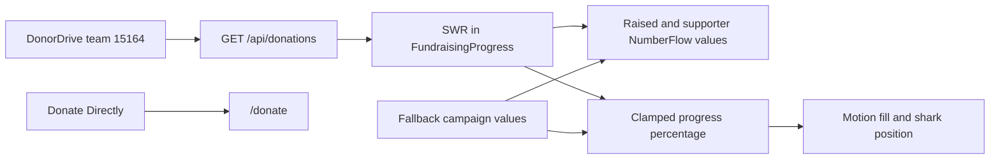

# Architecture Review

## Slice Boundary

Change the existing client-side fundraising presentation, add the NumberFlow dependency, and record verification artifacts. Preserve the homepage section order, `/api/donations` response shape, SWR refresh configuration, DonorDrive proxy behavior, and checkout path.

## Architecture Summary

`FundraisingProgress` remains the only behavioral component. SWR continues to provide live totals. NumberFlow renders the raised amount and donation count, while Framer Motion animates a semantic progress bar and the decorative shark to the same clamped percentage. The component uses supplied fallback values during loading or API failure and exposes a concise visible stale-data message on failure.

## Data Flow

## State Transitions

- Before intersection: the animated values and progress rest at zero.
- Section enters view: NumberFlow transitions to the current values; Motion fills the bar and moves the shark to the clamped percentage.
- SWR returns live data: the same renderers transition from fallback values to the live response.
- SWR refresh changes data: digits, fill, and shark update together.
- Reduced motion: NumberFlow respects the platform preference and Motion uses an immediate transition.
- Fetch error: recent fallback values remain visible with a restrained stale-data message.

## Trust Boundaries

- DonorDrive data is validated by the existing server route before reaching the client.
- The client treats the API response as display-only and never sends it into checkout logic.
- The donation CTA retains the internal `/donate` route; no payment behavior moves into this component.

## Edge Cases And Failure Modes

- A zero or invalid goal must not divide by zero; render zero progress.
- Negative totals clamp to zero and totals above goal clamp visual progress to 100% while preserving the displayed amount.
- The shark position must stay inside the track at both endpoints.
- Loading and failed fetches must retain readable values without implying the fallback is live.
- Long currency values and the goal label must wrap without horizontal overflow.
- Decorative shark motion and imagery must not duplicate progress information in the accessibility tree.

## Test Matrix

| Scenario | Expected result |
| --- | --- |
| Live API success | Live amount, goal, supporter count, fill, and shark agree |
| Local API failure | Recent fallback values render with a stale-data message |
| Initial viewport entry | Digits and bar transition once to the current values |
| Reduced motion | Final values render without animated travel |
| Above-goal total | Text shows the full amount; fill and shark stop at 100% |
| Zero goal | Progress remains at 0% without invalid CSS or arithmetic |
| Mobile viewport | Amount context stacks, labels remain readable, no horizontal overflow |
| Keyboard navigation | Donate action has visible focus and routes to `/donate` |

## Rollout, Rollback, And Observability

No migration or deploy-order dependency. Rollback is the component and dependency change. Existing API error logging and browser-visible stale-data messaging remain the observability surfaces; no new analytics or external calls are introduced.
