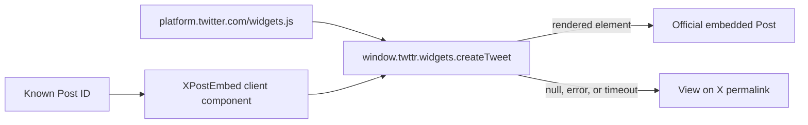

# Architecture Review

## Slice Boundary

Change only the homepage X post display, its official script loading, and the now-unused `react-tweet` dependency. Keep the existing post IDs, masonry layout, and all other social embeds unchanged.

## Architecture Summary

Add a small client component that owns one DOM container and asks `twttr.widgets.createTweet()` to render a known Post ID after the official script is ready. The component begins with a reserved-height loading state, replaces it with X's widget on success, and switches to a direct permalink after an error or bounded timeout. `next/script` loads X's official `https://platform.twitter.com/widgets.js` CDN endpoint once for the section, avoiding the redirect currently returned by `platform.x.com`. A typed runtime accessor keeps the integration explicit without exposing credentials or colliding with transitive embed package types.

## Data Flow

## State Transitions

- `loading` -> `ready` when `createTweet()` resolves with a rendered element.
- `loading` -> `fallback` when the script reports an error, the factory rejects/returns null, or the timeout expires.
- A Post ID change clears the owned widget container and starts a new render attempt; unmount cancels state updates and the timeout.

## Trust Boundaries

- `platform.twitter.com/widgets.js` is third-party executable code loaded in the browser.
- Post markup and media are rendered by X, not trusted local HTML.
- No X credentials, API tokens, or server routes are introduced.
- `dnt: true` reduces personalization use but does not make the request first-party or eliminate privacy-notice obligations.

## Edge Cases And Failure Modes

- Script blocked by privacy tooling or CSP: show the permalink fallback.
- X outage, deleted/protected Post, or unknown Post ID: factory returns null/rejects and shows fallback.
- Script loads after the component mounts: the section-level Script callback exposes readiness and triggers rendering.
- Script was already loaded before hydration/navigation: detect `window.twttr?.widgets` and render immediately.
- Slow network: keep a reserved-height loading card, then fail closed to the link after a bounded timeout.
- Component remount/Fast Refresh: clear the owned container before creating a new widget.
- Widget sizing: keep the owned target measurable beneath the loading overlay so X can calculate a responsive iframe width before the promise resolves.

## Test Matrix

| Scenario | Expected result |
| --- | --- |
| Official script and posts available | Three official X posts render with no runtime overlay |
| Script blocked or `onError` fires | Three direct X permalinks remain usable |
| Factory returns `null` or rejects | Only the affected post becomes a fallback card |
| Script never becomes ready | Loading state changes to fallback after the timeout |
| Desktop masonry | Embedded posts fit their columns without horizontal overflow |
| Narrow viewport | Posts remain within the page width |
| Keyboard/accessibility snapshot | Loading and fallback states have meaningful status/link text |
| Static checks | `pnpm lint`, `pnpm exec tsc --noEmit`, and `git diff --check` pass |

## Rollout, Rollback, And Observability

This is a frontend-only replacement. Rollback is restoring the link-only cards. Browser console errors, missing X widget DOM, and fallback-card counts are the useful local signals; no production telemetry is added in this slice.
