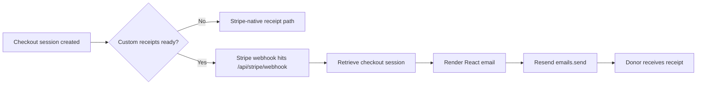

# Architecture Review

## Slice Boundary

Changes in scope:

- receipt email runtime dependency installation
- receipt setup documentation for the sender domain
- task artifacts for the investigation

Out of scope:

- Stripe checkout flow changes
- webhook contract changes
- production env mutation
- broader email template refactors

## Architecture Summary

The receipt system already exists in three stages:

1. `/api/stripe/checkout-session` decides whether Stripe-native receipts stay on or the custom webhook path owns delivery.
2. `/api/stripe/webhook` verifies Stripe signatures, retrieves the session, and calls `sendDonationReceiptEmail`.
3. `sendDonationReceiptEmail` renders the React receipt template and sends it through Resend.

The investigation found two independent blockers:

- hosted and local examples use a `RESEND_FROM_EMAIL` on `nicolematt.com`, but the verified Resend sending domain is `gonatego.com`
- the webhook path sends `react:` content through the Resend SDK without the required `@react-email/render` peer dependency installed

This slice fixes the repo-level runtime blocker and aligns the docs with the verified sending domain.

## Data Flow

## State Transitions

- Missing enable flag or webhook secret: checkout keeps `receipt_email` on the Stripe payment intent
- Valid webhook event with working render dependency and verified sender: receipt is sent
- Valid webhook event with missing render dependency: webhook returns 500 before calling Resend
- Valid webhook event with unverified sender domain: Resend rejects the send request

## Trust Boundaries

- Stripe webhook payload remains untrusted until signature verification succeeds
- Resend accepts or rejects sends based on API key auth and verified-domain ownership
- Environment configuration controls whether the custom path is active and whether the sender is permitted

## Edge Cases And Failure Modes

- local app test mode does not have a paid checkout session, so an async-success event is the safest synthetic webhook for end-to-end testing
- preview and local envs may not have the custom receipt path enabled
- production can still fail after the dependency fix if the sender domain remains unverified

## Test Matrix

- Resend CLI auth and domain verification checks
- Resend CLI invalid-sender rejection using the current configured `nicolematt.com` sender
- Resend CLI valid-sender success using `gonatego.com`
- local app checkout-session creation with custom receipts forced on
- local webhook POST against the real route before and after installing the render dependency
- lint and TypeScript verification after the dependency/doc changes

## Rollout, Rollback, And Observability

- Rollout: ship the dependency and docs, then update hosted `RESEND_FROM_EMAIL` to a `gonatego.com` sender and redeploy when approved
- Rollback: revert the dependency/doc change; no data migration is involved
- Observability: keep using webhook logs plus Resend CLI/API checks to distinguish render failures from sender-domain rejections
