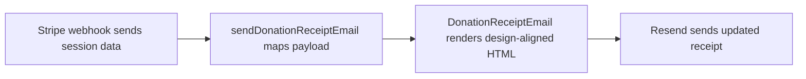

# Architecture Review

## Slice Boundary

Changes in scope:

- `components/emails/donation-receipt-email.tsx`
- `lib/email/send-donation-receipt.tsx`
- task artifacts

Out of scope:

- webhook route behavior
- Stripe session creation
- Vercel or Stripe configuration

## Architecture Summary

The existing send pipeline stays intact. The change is limited to the receipt template structure and the payload fields needed to support the approved design, such as split paid date/time, receipt emailed time, support display fields, and Stripe sender details.

## Data Flow

## State Transitions

- Existing receipt send still occurs once per eligible Stripe event
- Template receives richer display fields but no new side effects
- Missing optional support fields fall back to safe defaults taken from the approved design

## Trust Boundaries

- Stripe session and charge data remain the source of truth for amount, receipt number, and paid time
- Env values can override support contact fields
- Template must not fabricate payment facts beyond what is derivable from Stripe

## Edge Cases And Failure Modes

- No `latest_charge` still needs a usable receipt
- Reply-to email missing
- Phone missing
- Stripe account lookup unavailable for the sender detail row
- Email clients ignoring some overlap/spacing CSS

## Test Matrix

- Lint passes with zero warnings
- TypeScript passes with zero errors
- Rendered structure reflects the Paper artboard section order and copy
- Fallback copy still reads cleanly when optional support fields are absent

## Rollout, Rollback, And Observability

- No rollout change beyond redeploying the updated template
- Rollback is the previous template commit
- Existing webhook/send logs remain sufficient because behavior does not change
